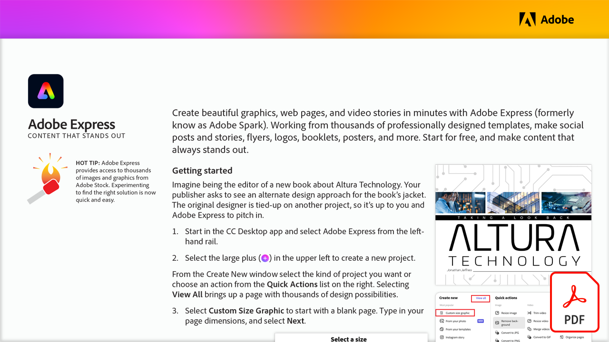

# Adobe Express：突出显示的内容

使用Adobe Express（以前称为Adobe Spark）在几分钟内创建精美的图形、网页和视频故事。 使用数千个专业设计的模板制作社交帖子和故事、传单、徽标、小册子、海报等。 免费开始，制作始终脱颖而出的内容。

选择下方图像以查看或下载此PDF教程。

[{width="680"}](assets/Adobe-Express-content-that-stands-out.pdf){target="blank"}
