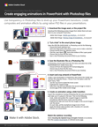

# 解码图形格式的字母汤

JPG、PNG、SVG、GIF和EPS文件通常用于设计，有些用于网页，有些用于演示文稿、出版物和创意项目。 但是，它们是什么意思，你该选哪个？ 在这个15分钟的动手实践研讨会中了解详情。 快速了解如何在Photoshop中应用透明度效果，在探索不同图形导出和优化设置的同时，将您的演示技能提升到一个新的水平。 与设计人员/开发人员Chris Converse一起使用从Photoshop导出的自定义图形，在PowerPoint中创建引人注目的动画。

>[!VIDEO](https://video.tv.adobe.com/v/333805?hidetitle=true)

  

[**下载快速参考PDF指南**](../quick-reference/Decodingthealphabetsoupofgraphicformats.pdf)

