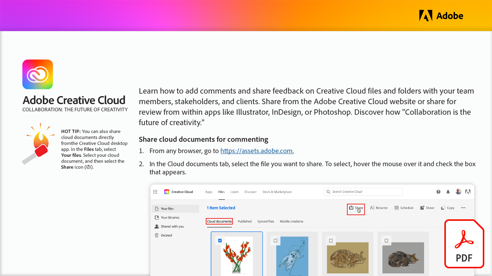

# 协作：创造力的未来

了解如何与您的团队成员、利益相关者和客户就 Creative Cloud 文件和文件夹添加评论和共享反馈。 从Adobe Creative Cloud网站共享或从Illustrator、InDesign或Photoshop等应用程序中共享以供审阅。

选择下方图像以查看或下载此PDF教程。

[{width="680"}](assets/Collaboration-The-Future-of-Creativity.pdf){target="blank"}
