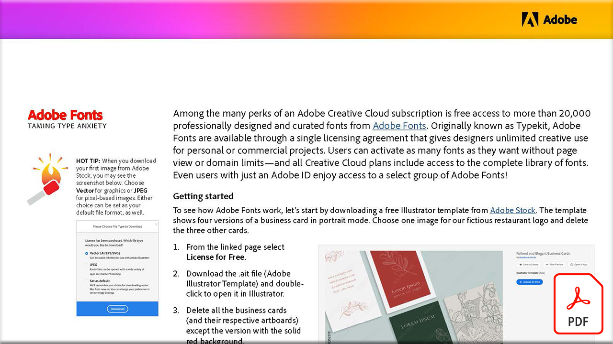

# 驯服型焦虑

Adobe Creative Cloud订阅具有多种额外功能，其中包括，可免费访问Adobe Fonts提供的超过20,000种专业设计和精选的字体。 Adobe Fonts最初称为Typekit，可通过单个许可协议获得，此协议为设计人员提供了针对个人或商业项目的无限创意用途。

选择下方图像以查看或下载此PDF教程。

[{width="680"}](assets/Adobe-Fonts-Taming-Font-Anxiety.pdf){target="blank"}
