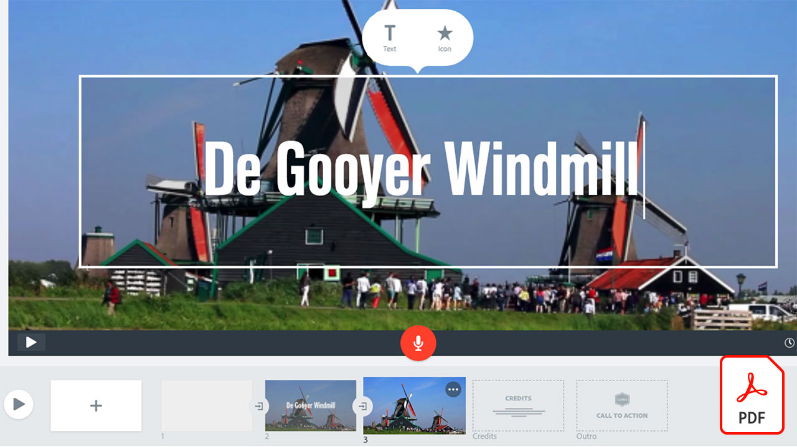

# 视频快速参考指南

使用适用于视频编辑、动态图形、视觉效果、动画等的Adobe软件和应用程序，让您的想法变为现实。 选择要下载的图像或查看快速参考指南PDF。

## Adobe Audition

<table>
<tr>
   <td>
      
      

      <a href="assets/QuicklyRemoveUnwantedAudioContentwiththeSpotHealingBrushinAdobeAudition.pdf" target="_blank"><strong>使用Adobe Audition中的“污点修复画笔”(PDF)快速移除不需要的音频内容</strong></a>
      

      <em>您是否知道Adobe Photoshop污点修复画笔可让您在Adobe Audition中移除音频文件中影响美观的声音？</em>
       
  </td>
  <td>
    
    

     
  </td>
  <td>
    
    

     
  </td>
  <td>
    
    

     
  </td>
</tr>
</table>

## Adobe Express(前身为Adobe Spark)

<table>
<tr>
<td>
   
    

   <a href="assets/ShowcaseyourSparkVideoinyourSparkPage.pdf" target="_blank"><strong>在您的Spark Page(PDF)中展示您的Spark Video</strong></a>
    

    <em>通过Adobe Spark Page，您可以从各种来源加载视频，包括使用Spark Video创建的视频！</em>
     
  </td>
  <td>
    
    

     
  </td>
  <td>
    
    

     
  </td>
  <td>
    
    

     
  </td>
</tr>
</table>

## After Effects

<table>
<tr>
 <td>
   
    

   <a href="assets/AfterEffectsforPhotography.pdf" target="_blank"><strong>After Effects摄影版(PDF)</strong></a>
    

    <em>了解如何使用After Effects中的神奇效果来增强照片效果</em>
     
  </td>
  <td>
   
    

   <a href="assets/CinemagraphsTheMesmerizingPlaceBetweenaPhotoandaVideo.pdf" target="_blank"><strong>电影胶片：照片和视频之间的迷人位置(PDF)</strong></a>
    

    <em>了解更多关于影片的信息 — 这些引人注目的混合图像存在于照片和视频之间</em>
     
  </td>
  <td>
   
    

   <a href="assets/CreateanIllustrationfromanAdobeStockPhotowithAfterEffects.pdf" target="_blank"><strong>使用After Effects (PDF)从Adobe[!DNL Stock]照片创建插图</strong></a>
    

    <em>将色相/饱和度和色阶与After Effects中的卡通效果相结合，从Adobe[!DNL Stock]照片中创建一个独特的风格化插图</em>
     
  </td>
   <td>
   
    

   <a href="assets/CreateBeautifulKaleidoscopePatternswithAfterEffects.pdf" target="_blank"><strong>使用After EffectsPDF创建精美的万花筒图案)</strong></a>
    

    <em>使用Adobe After Effects中的CC万花筒效果，从任何图像创建无限数量的图案和纹理</em>
     
  </td>
</tr>
<tr>
<td>
   
    

   <a href="assets/CreateIntricateTransparencyinyourPhotographswithKeyinginAfterEffects.pdf" target="_blank"><strong>使用After Effects中的键控功能在照片中创建复杂的透明效果(PDF)</strong></a>
    

    <em>抠像用于视频很多，当设计项目需要您的照片时，它也会大有帮助</em>
     
  </td>
 <td>
   
    

   <a href="assets/CreateAnimatedTitlesUsingMotionGraphicsTemplatesinAdobePremiereRush.pdf" target="_blank"><strong>在Adobe Premiere中使用动态图形PDF创建动画字幕[!DNL Rush]（模板）</strong></a>
    

    <em>通过添加适合您的故事或匹配您的个人品牌的专业设计的动态图形模板，让您的视频看起来更加令人惊叹</em>
     
  </td>
  <td>
      
      

      <a href="assets/DazzlingLightEffectsforPhotographywithAfterEffects.pdf" target="_blank"><strong>使用After Effects的摄影炫目的灯光效果(PDF)</strong></a>
      

      <em>Adobe After Effects中的光照效果可以显着改变照片的外观</em>
       
  </td>
  <td>
      
      

      <a href="assets/EditingVRPhotography360photoswithAfterEffects.pdf" target="_blank"><strong>使用After Effects(PDF)编辑VR摄影（360度照片）</strong></a>
      

      <em>尽管更多沉浸式交互式游戏和体验并不是那么常见，但360度摄影已出现</em>
       
  </td>
</tr>
</table>

## Premiere Rush

<table>
<tr>
   <td>
      
      

      <a href="assets/SmoothlyCombineMusicandDialogueorNarrationwithAutoduckinginAdobePremiereRush.pdf" target="_blank"><strong>在[!DNL Adobe Premiere Rush]中通过自动闪避顺畅地组合音乐和对话或旁白(PDF)</strong></a>
      

      <em>Adobe Premiere [!DNL Rush]在一个易于使用的应用程序中提供了高级视频编辑功能，因此任何人都可以在几分钟内制作专业品质的视频</em>
       
  </td>
  <td>
    
    

     
  </td>
  <td>
    
    

     
  </td>
  <td>
    
    

     
  </td>
</tr>
</table>
