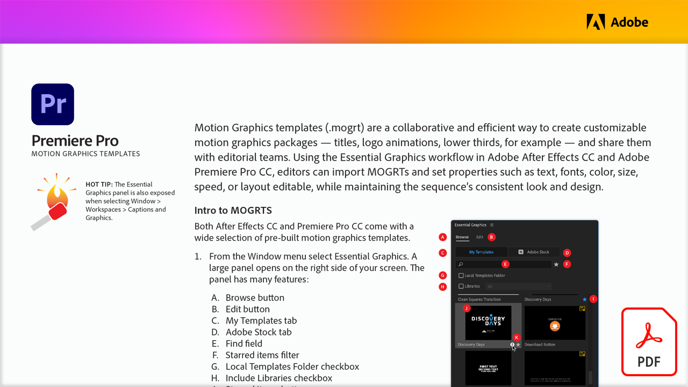
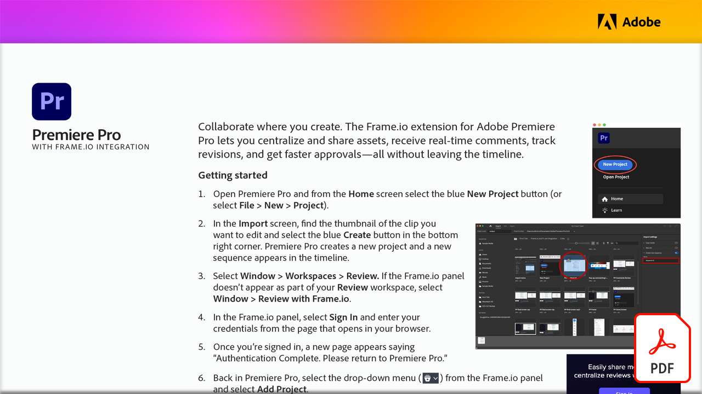

# Adobe视频教程

使用适用于视频编辑、动态图形、视觉效果、动画等的Adobe软件和应用程序，让您的想法变为现实。 选择一个图像以查看教程。

<table>
<tr>
 <td>
   
    

   <a href="motion-graphics-templates.md"><strong>专业的动态图形模板</strong></a>
    

    <em>动态图形模板(.mogrt)是一种协作且有效的方法，可创建可自定义的动态图形包（标题、徽标动画、字幕条，并与编辑团队共享）</em>
     
  </td>
  <td>
   
    

   <a href="video-review-frame-io.md"><strong>使用Frame.io进行视频审阅</strong></a>
    

    <em>了解适用于Adobe Premiere Pro的Frame.io扩展如何让您在不离开时间轴的情况下，集中和共享资源、接收实时注释、跟踪修订以及获得更快的批准</em>
     
  </td>
  <td>
    
    

     
  </td>
  <td>
    
    

     
  </td>
</tr>
</table>
