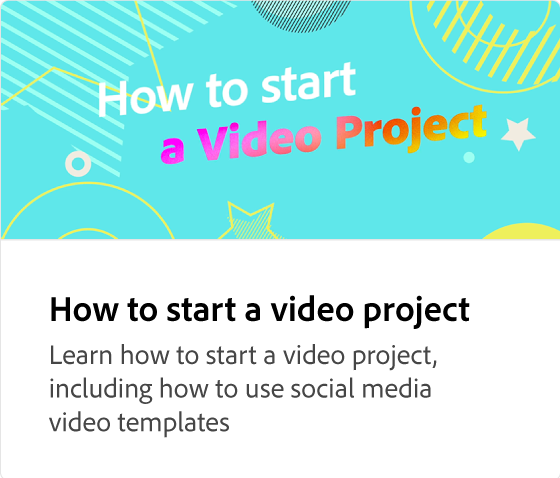
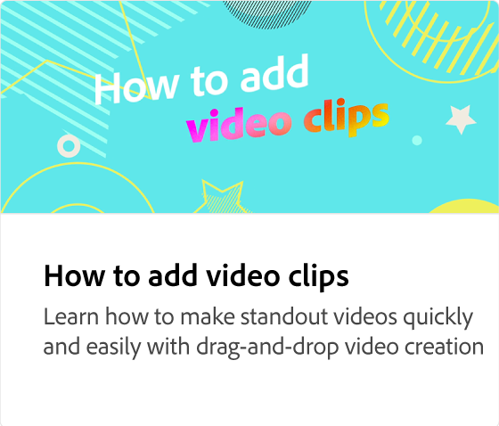
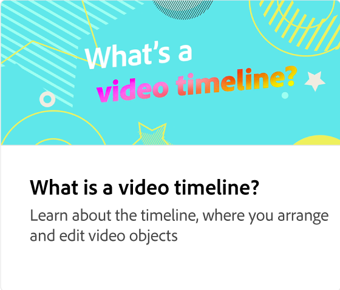
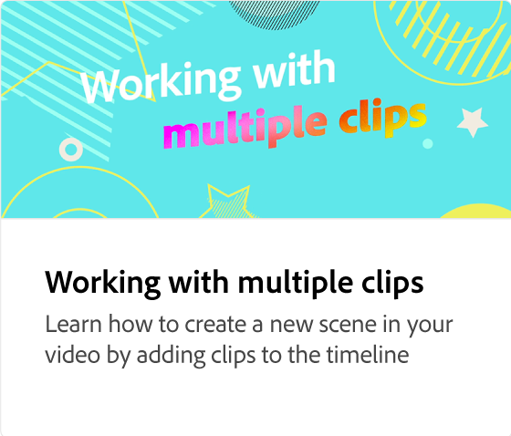

# 如何添加音频

了解如何通过添加音频来创建吸引人且令人难忘的项目。 您可以上传自己的音频文件，或从免版税的Stock音频中进行选择。 您还可以录制画外音并调整音频和画外音的音量。

>[!VIDEO](https://video.tv.adobe.com/v/3436861?captions=chi_hans&quality=12&learn=on&hidetitle=true)

## 此系列中的其他视频

<table style="table-layout:fixed">
<tr>
   <td>
         
   </td>
  <td>
         
   </td>
   <td>
         
   </td>
   <td>
         
   </td>
</tr>
<tr>
    <td>
         
   </td>
   <td>
    
    

     
   </td>
   <td>
    
    

     
   </td>
   <td>
    
    

     
   </td>
</tr>
</table>
