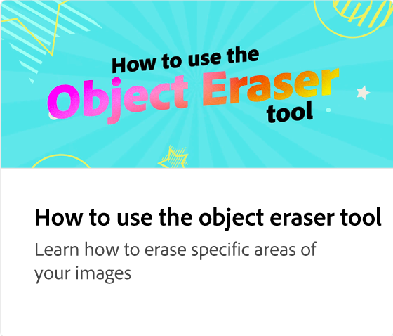

# 如何编辑PDF

了解如何通过添加引人注目的文本、图像、品牌、颜色、动画等，让您的静态、过时PDF焕然一新。 编辑完成后，您可以下载PDF、共享文档或将PDF转换为其他文件格式（例如JPEG）。

>[!VIDEO](https://video.tv.adobe.com/v/3427024?quality=12&learn=on&hidetitle=true)

## 此系列中的其他视频

<table style="table-layout:fixed">
<tr>
   <td>
         
   </td>
   <td>
         
   </td>
   <td>
         
   </td>
   <td>
         
   </td>      
</tr>
<tr>
   <td>
      
   </td>
   <td>
      
   </td>
   <td>
      
   </td>
    <td>
      
   </td>
</tr>
</table>
