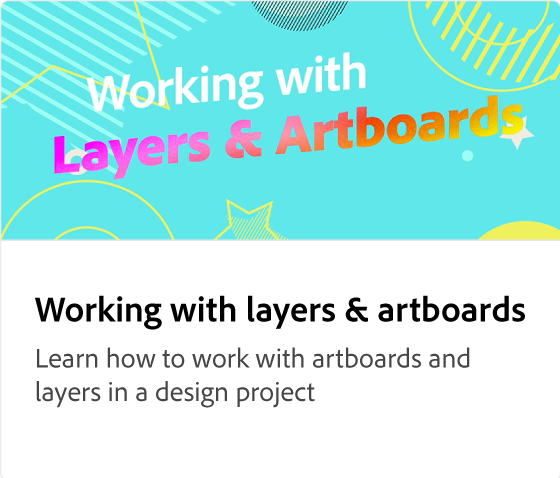

# 如何共享和下载

了解以下载和共享不同文件格式(例如PNG、JPEG或PDF)项目的选项。 Publish将项目发布到Web并生成链接以便轻松访问，或者利用选项直接将媒体安排和共享到社交媒体平台，以便为每个平台自定义帖子。

>[!VIDEO](https://video.tv.adobe.com/v/3426936?quality=12&learn=on&hidetitle=true)

## 此系列中的其他视频

<table style="table-layout:fixed">
<tr>
   <td>
      
  </td>
   <td>
      
  </td>
   <td>
      
   </td>
   <td>
      
   </td>
</tr>
<tr>
   <td>
      
  </td>
   <td>
      
  </td>
   <td>
      
  </td>
   <td>
         
   </td>
</tr>
<tr>
   <td>
         
   </td>
   <td>
   
   </td>
   <td>
   
   </td>
   <td>
      
      

       
   </td>
</tr>
</table>
