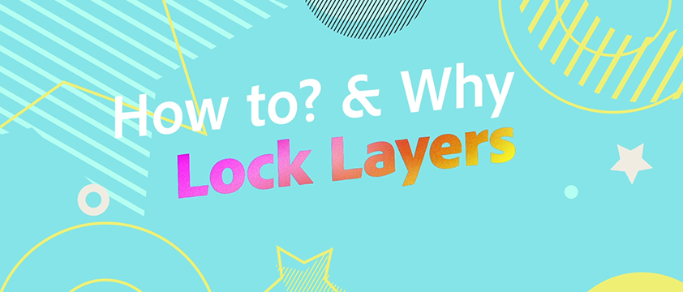
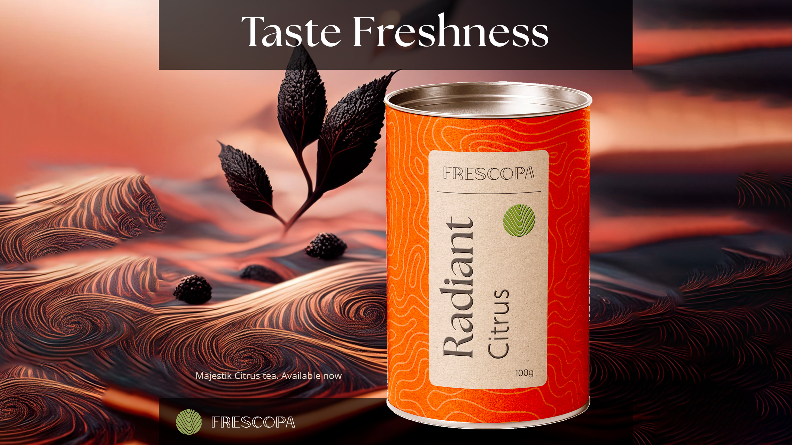
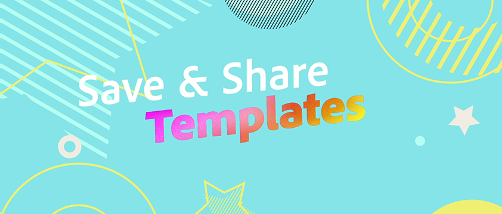

# 轻松实现品牌与模板的一致性

了解如何在整个组织中快速、高效地创建品牌内容。 本教程将逐步介绍如何创建可立即共享和本地化的全新品牌内容。

>[!VIDEO](https://video.tv.adobe.com/v/3427099?quality=12&learn=on&hidetitle=true)

## 此系列中的其他视频

<table style="table-layout:fixed">
<tr>
    <td>
        
        

            <a href="lock-layers.md"><strong>如何锁定图层和锁定图层的原因</strong></a>
            

            <em>了解锁定模板的各种元素为何重要</em>
             
    </td>
    <td>
         
         

         <a href="create-templates.md"><strong>最大化效率：创建可重复使用的模板</strong></a>
         

         <em>了解如何使用模板为您的组织带来品牌一致性、效率和成本节约</em>
          
   </td>
   <td>
         
         

         <a href="share-templates.md"><strong>保存和共享模板</strong></a>
         

         <em>了解如何保存模板并将其共享到团队的品牌套件或库中</em>
          
   </td>
    <td>
      
      

       
    </td>
</tr>
</table>
