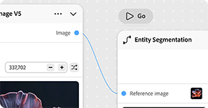

# &#x200B;2. Firefly Graph关键概念

了解帮助您开始使用Firefly Graph的关键概念。

## 节点

节点执行工作流中的一个步骤 — 一个节点，一个作业。 节点可以生成图像、应用蒙版、改变颜色或运行任何其他单个创意操作。

{align="center"}

## 端口

节点上的连接点。 输出端口将数据从节点传出；输入端口接收传入的数据。 连接端口是数据流通过工作流程的方式。

{align="center"}

## 构件

节点上的交互式控件，如文本字段、下拉列表和滑块，可让您直接在编辑器中配置其设置。

{align="center"}

## 连接

连接在两个节点之间传递输入或输出。 图形从左到右读取，从源输入到最终输出。

{align="center"}

## 图形

在编辑器中构建的完整工作流程。 图形由布置在画布上的节点和连接组成，以产生最终输出。

{align="center"}

## 下一步

准备好建东西了吗？ 移至[3。 创建第一个图形](https://experienceleague.adobe.com/zh-hans/docs/creative-cloud-enterprise-learn/cce-learning-hub/fireflyoverview/firefly-graph/create-your-first-graph)以进行分步演练。

返回[开始使用萤火虫图形](https://experienceleague.adobe.com/zh-hans/docs/creative-cloud-enterprise-learn/cce-learning-hub/fireflyoverview/firefly-graph/overview-firefly-graph)。
