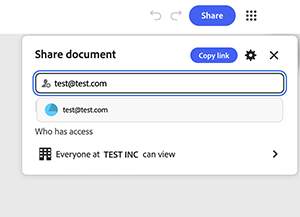

# &#x200B;5. 共享图表

了解如何与他人共享图表。 共享图表可共享实时工作流程，而不仅仅是输出。 任何具有编辑访问权限的人员都可以重新运行它、更改它，然后将其移交给其他人。 使用链接级访问在组织内实现广泛的可见性，并为需要直接访问的任何人指定具有特定角色的邀请。

1. 选择图形右上角的&#x200B;**共享**。

   {align="center"}

   该对话框将打开，其中包含用于添加姓名或电子邮件的字段，以及当前有权访问的用户的摘要。 默认情况下，只有受邀人员才能访问图形。

1. 选择齿轮图标以打开&#x200B;**设置**。

   {align="center"}

   提供三种访问级别：仅受邀人员、组织中的所有人员或具有此链接的任何人。

1. 选择&#x200B;**[组织]中的所有人均可查看**，以允许公司内的任何人打开具有此链接的图表。

   {align="center"}

   通过搜索打开“可发现”，以便成员可以找到图表，根本不需要链接。
确认横幅精确地表明谁可以使用链接查看图形。 请在将链接发送到任意位置之前检查此项。 它适用于该链接的每个未来接收者，而不仅仅是下一个受邀者。

   {align="center"}

1. 在“邀请”字段中直接键入一个电子邮件地址，以向其中一位指定人员授予访问权限，而不采用“常规”链接设置。 从字段下方显示的建议中选择他们的条目。

   {align="center"}

1. 选择其名称旁边的角色下拉列表以选择“编辑器”或“查看器”。

   {align="center"}

   编辑者可以编辑、下载和共享图表。 查看器只能查看它。 选择较窄的角色，除非该人员需要更改图表本身。

1. 在&#x200B;**消息**&#x200B;字段中添加可选注释，以便收件人知道他们获取访问权限的原因。 选择&#x200B;**邀请作为编辑器**&#x200B;或&#x200B;**邀请作为查看者**（如果已选择该角色）以发送它。

   {align="center"}

## 下一步

要从模板开始吗？ 前往[5。 自定义模板](https://experienceleague.adobe.com/en/docs/creative-cloud-enterprise-learn/cce-learning-hub/fireflyoverview/firefly-graph/customize-template)，使其反映您自己的简介。

返回[开始使用Firefly图形](https://experienceleague.adobe.com/en/docs/creative-cloud-enterprise-learn/cce-learning-hub/fireflyoverview/firefly-graph/overview-firefly-graph)。