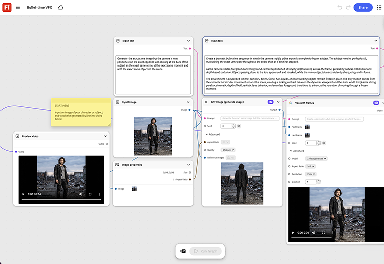

# Bullet Time VFX

了解如何馈送主产品或主体图像以生成旋转序列
之后自动缝合冻结帧扫描。 [打开Bullet Time VFX模板](https://firefly.adobe.com/graph/edit/id/urn:aaid:sc:US:3efb4f51-345d-58eb-b7c8-7b289f0dd1c4)。

>[!TIP]
>
>**开始之前** — 为获得最佳效果，请根据您自己的品牌、产品和工作流程自定义此模板。 在使用任何输出之前，交换参考图像、提示和副本。

{align="center"}

[!BADGE 用例]{type=Informative tooltip="使用案例"}

* **户外** — 为付费社交广告制作一个动态攀爬者的子弹时刻英雄照片，无需在现场安装多相机装备。
* **零售** — 为产品发布页面创建新运动鞋的360度冻结帧快照。
* **汽车** — 为数字展厅生成车辆的旋转英雄照片，无需转盘式摄影棚会话。

返回[开始使用Firefly图形](https://experienceleague.adobe.com/zh-hans/docs/creative-cloud-enterprise-learn/cce-learning-hub/fireflyoverview/firefly-graph/overview-firefly-graph)。
