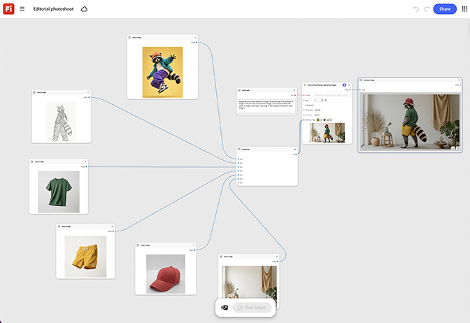

# 时事摄影

了解如何输入模型参考并替换每个新外观的服装输入。 姿势和光照节点在整个场景中保持锁定状态，以获得一致的编辑感觉。 [打开编辑照片拍摄模板](https://firefly.adobe.com/graph/edit/id/urn:aaid:sc:US:cfd7b810-2f86-5cdf-af80-dd2e31b8b84b)。

>[!TIP]
>
>**开始之前** — 为获得最佳效果，请根据您自己的品牌、产品和工作流程自定义此模板。 在使用任何输出之前，交换参考图像、提示和副本。

{align="center"}

[!BADGE 用例]{type=Informative tooltip="使用案例"}

* **零售** — 在一个模特身上进行服装交换，拍摄一个季节性的肖像画，而不用为每个个人肖像重新预订模特。
* **美观** — 使用一个模型引用跨多个产品外观构建一致的可编辑系列。
* **户外** — 从单个模特照片中生成全新的夹克色彩组合完整编辑集。

返回[开始使用Firefly图形](https://experienceleague.adobe.com/en/docs/creative-cloud-enterprise-learn/cce-learning-hub/fireflyoverview/firefly-graph/overview-firefly-graph)。
