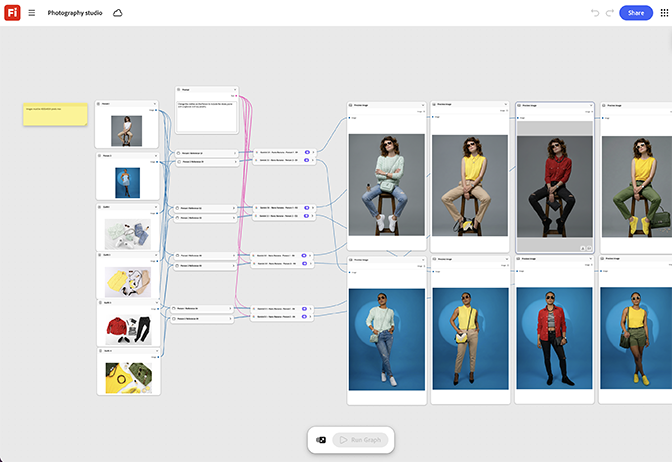

# 摄影工作室

了解如何将产品渲染放置在摄影棚背景节点上，并调整光照索具节点，直到结果看起来像真实的工作室捕捉。 [打开摄影工作室模板](https://firefly.adobe.com/graph/edit/id/urn:aaid:sc:US:63ad7c3b-2cb3-5474-ba8c-7e1c8d8a570f)。

[!BADGE 行业示例]{type=Informative tooltip="行业示例"}

* **饮料** — 在计划进行物理产品摄影之前，生成新风味SKU的干净的工作室产品照片。
* **技术** — 在设备可供拍摄之前，为启动页面创建新设备的工作室品质渲染。
* **零售** — 在整个产品线中制作一致的摄影室照片，而无需预约个人摄影课程。

>[!TIP]
>
>**开始之前** — 为获得最佳效果，请根据您自己的品牌、产品和工作流程自定义此模板。 在使用任何输出之前，交换参考图像、提示和副本。

{align="center"}

返回[开始使用萤火虫图形](https://experienceleague.adobe.com/zh-hans/docs/creative-cloud-enterprise-learn/cce-learning-hub/fireflyoverview/firefly-graph/overview-firefly-graph)。
