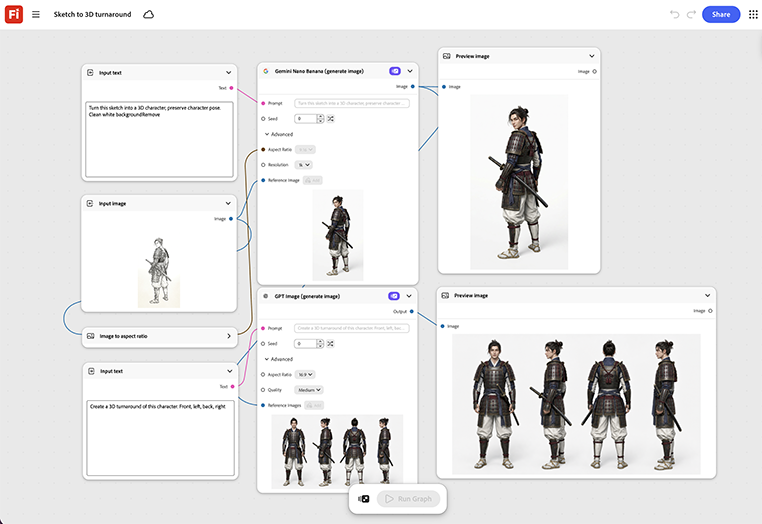

# 草图到3D转折

了解如何将素描转换为3D角色。 该图形会从中构建一个旋转的3D周转方案，可在进行任何物理原型制作之前进行内部设计审核。 [打开Sketch到3D周转模板](https://firefly.adobe.com/graph/edit/id/urn:aaid:sc:US:984a5ded-67e1-5a78-9283-52a0126bf8b2)。

[!BADGE 行业示例]{type=Informative tooltip="行业示例"}

* **技术** — 在提交物理原型生成之前，将早期硬件概念草图转换为3D设计审核周转方案。
* **汽车** — 将早期车辆概念草图可视化为旋转的3D转向，以供内部审阅。
* **娱乐** — 将角色概念草图变成幻灯片甲板的3D转折。

>[!TIP]
>
>**开始之前** — 为获得最佳效果，请根据您自己的品牌、产品和工作流程自定义此模板。 在使用任何输出之前，交换参考图像、提示和副本。

{align="center"}

返回[开始使用萤火虫图形](https://experienceleague.adobe.com/en/docs/creative-cloud-enterprise-learn/cce-learning-hub/fireflyoverview/firefly-graph/overview-firefly-graph)。
