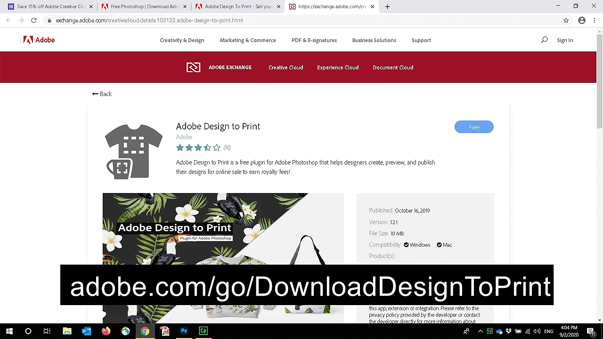
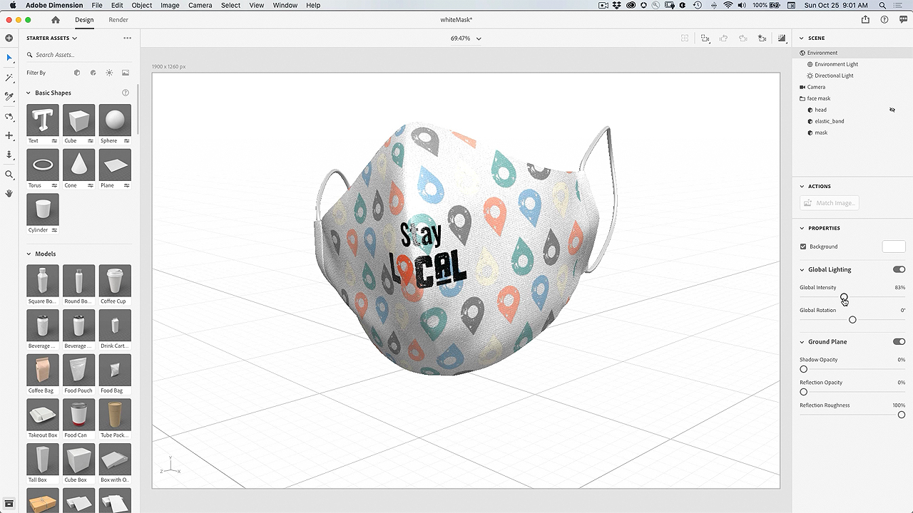
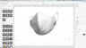

# 打印增效工具设计 — 自定义面罩

如果您能用自己的图稿定制一个面罩，是不是很酷？ 借助AdobeDesign to Print插件，您可以在数百种Zazzle产品上将设计可视化，并直接发布到其在线市场。

## 浏览Facemask项目Tutorials

<table style="table-layout:fixed">
<tr>
 <td>
   
    

   <a href="handsonproject.md#tutorial1"><strong>安装Photoshop Design to Print增效工具</strong></a>
    

    <em>使用Adobe Photoshop中强大的选择和颜色编辑工具来显着更改图像，以满足您的公司品牌推广需求</em>
     
  </td>
  <td>
    
    

    <a href="handsonproject.md#tutorial2"><strong>使用要打印的设计自定义人脸蒙版</strong></a>
    

    <em>自定义您自己的Zazzle面罩</em>
     
  </td>
  <td>
    
    

   <a href="handsonproject.md#tutorial3"><strong>创建面罩的3D可视化</strong></a>
    

    <em>为活动库创建人脸蒙版的3D可视化</em>
     
  </td>
</tr>
</table>

## 安装Photoshop Design to Print增效工具(1:50) {#tutorial1}

>[!VIDEO](https://video.tv.adobe.com/v/327096?hidetitle=true)

**描述**
了解如何安装适用于Photoshop的Design to Print增效工具。

在本教程中，您将了解如何：
* 实时在服装、配件、文具和墙壁艺术作品上呈现您的设计！
* Publish到Dazzle在线市场

**演示者：**
Patti Sokol，首席解决方案顾问（数字媒体）

## 使用“Design to Print”（要打印的设计）自定义蒙版(7:54) {#tutorial2}

>[!VIDEO](https://video.tv.adobe.com/v/327097?hidetitle=true)

**描述**
自定义您自己的Zazzle面罩

在本教程中，您将了解如何：
* 实时在服装、配件、文具和墙壁艺术作品上呈现您的设计！
* Publish到Dazzle在线市场

**单击图像以下载Learn Design to PrintPDF**

**演示者：**
Patti Sokol，首席解决方案顾问（数字媒体）

## 创建面罩(7:54)的3D可视化 {#tutorial3}

>[!VIDEO](https://video.tv.adobe.com/v/327098?hidetitle=true)

**描述**
为活动库创建人脸蒙版的3D可视化

在本教程中，您将了解如何：
* 轻松创建照片级逼真的3D可视化
* 添加材质和控制光照，打造专业外观
* 导入资源以应用您的品牌或其他设计

**单击图像以下载包含3D白色蒙版模型的[!DNL Dimension]文件**

**演示者：**
Patti Sokol，首席解决方案顾问（数字媒体）
