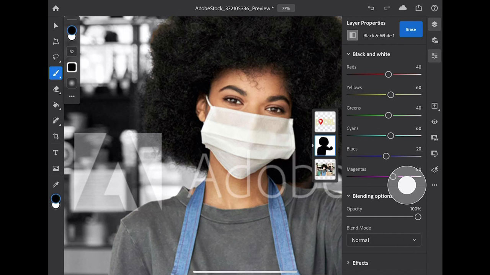

# iPad 版 Photoshop

Photoshop是世界上最好的图像处理和图形设计软件，让专业人士能够跨设备发挥无限的创造力。 现在，任何人都可以随心所欲地创作出自己想象的任何作品，任何地方都能激发灵感。 想想看，用Photoshop就行了。

## 浏览产品Tutorials

<table style="table-layout:fixed">
<tr>
 <td>
   
    

   <a href="photoshopipad.md#tutorial1"><strong>iPad上的Photoshop简介</strong></a>
    

    <em>观看界面教程，了解Photoshop中一些重新设计用于Apple iPad的功能</em>
     
  </td>
  <td>
    
    

     
  </td>
  <td>
    
    

     
  </td>
</tr>
</table>

## iPad (5:14)上的Photoshop简介 {#tutorial1}

>[!VIDEO](https://video.tv.adobe.com/v/326899?hidetitle=true)

**描述**
浏览界面，了解Photoshop中一些重新设计用于在Apple iPad中的功能。

在本教程中，您将了解如何：
* 可在上访问您喜爱的Photoshop工具
* 在移动设备上精确编辑，而不会降低质量
* 更沉浸式和自然的体验
* 使用云文档实现无缝工作流

**演示者：**
解决方案顾问Dan Armstrong （数字媒体）

**iPad资源上的Photoshop**

[学习和支持](https://helpx.adobe.com/cn/support/photoshop.html)是您获取其他教程和社区论坛链接的中心点。

**2020年10月版**

开始使用这些功能（以及更多功能！） 从Creative Cloud桌面应用程序下载最新更新。
