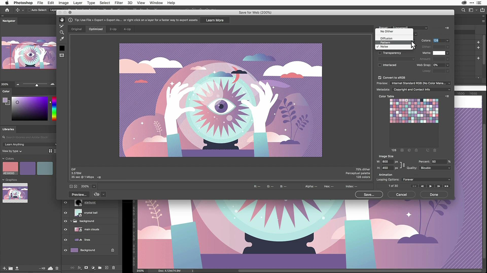
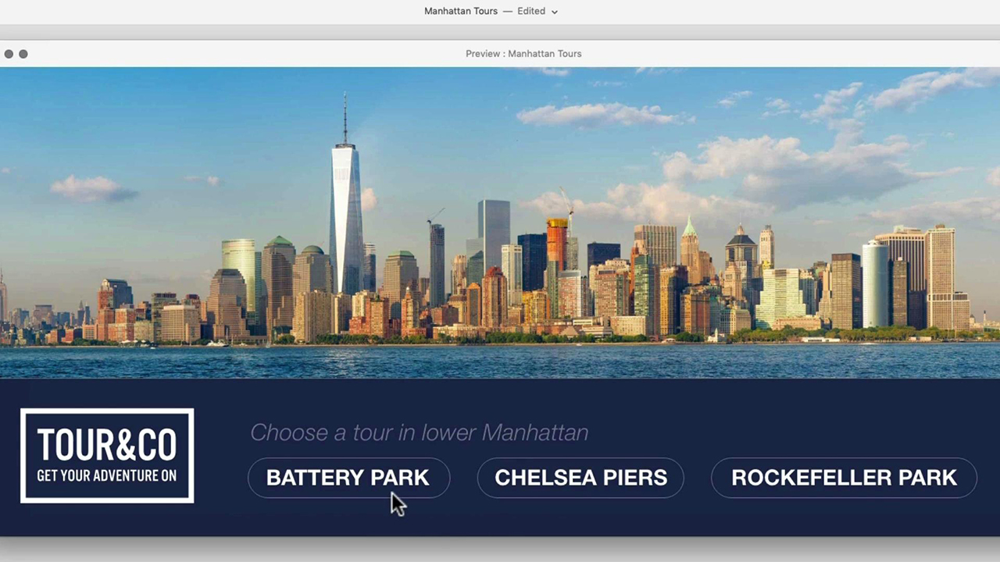
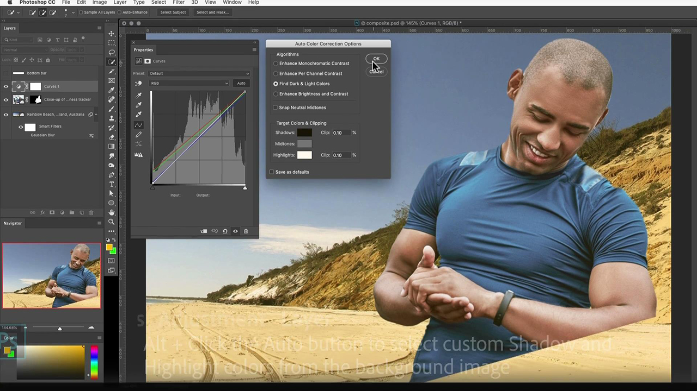
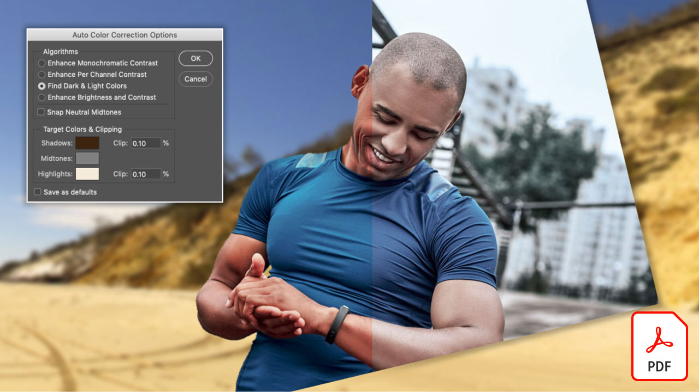
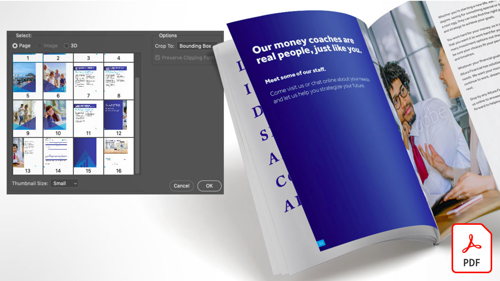

# Adobe[!DNL Stock]教程

创意人员面临着快速提供引人入胜的视觉内容的压力。 Adobe Stock让创意团队每天可以在Creative Cloud应用程序中访问超过3亿张免版税图像、视频、音频文件、模板、插图和3D资源。 无限制访问Adobe Stock标准资源和Creative Cloud专业版。 在stock.adobe.com上浏览最新收藏集。 选择一个图像以查看教程。

<table>
<tr>
   <td>
      
      

      <a href="stunning-digital-assets.md"><strong>令人惊叹的数字资源(PDF)</strong></a>
      

      <em>在本实际操作教程中，了解如何将Adobe Stock与CC Libraries集成以创建一致且专业的设计结果用于打印和屏幕</em>
       
  </td>
  <td>
      
      

      <a href="searchstock.md"><strong>搜索Adobe[!DNL Stock]许可历史记录</strong></a>
      

      <em>了解如何在Creative Cloud企业版中快速搜索组织的Adobe[!DNL Stock]许可历史记录</em>
       
  </td>
  <td>
      
      

      <a href="handdrawn.md"><strong>将手绘美学添加到Adobe[!DNL Stock]图像</strong></a>
      

      <em>使用适用于iPad的Photoshop，通过独特的技术为图像增添深度和维度，从而增添创意营销效果</em>
       
  </td>
  <td>
   
    

   <a href="flairtypography.md"><strong>通过蒙版和动画为排版增添风格</strong></a>
    

    <em>利用Adobe[!DNL Stock]中的元素和After Effects中的动画样式，让您的文本栩栩如生</em>
     
  </td>
</tr>
<tr>
  <td>
      
      

      <a href="animatevector.md"><strong>在Photoshop中为Adobe[!DNL Stock]矢量插图制作动画</strong></a>
      

      <em>使用可编辑的矢量图将动画带入新闻稿图形中，以用于Adobe[!DNL Stock]</em>
       
  </td>
 <td>
      
      

      <a href="annualreport.md"><strong>以使用Adobe[!DNL Stock]和Spark Video创建的视频开始您的年度报告</strong></a>
      

      <em>使用Adobe[!DNL Stock]和Spark Video制作年报</em>
       
  </td>
  <td>
      
      

      <a href="customanimations.md"><strong>通过Adobe[!DNL Stock]</strong></a>使用自定义动画让创意变为现实
      

      <em>在Photoshop中使用Adobe[!DNL Stock]图像、纹理、图案自定义动画</em>
       
  </td>
  <td>
      
      

      <a href="changecolors.md"><strong>更改Adobe[!DNL Stock]图像的颜色以匹配您的故事</strong></a>
      

      <em>在Adobe[!DNL Stock]中找到一张独一无二的照片，然后在Adobe Photoshop中调整颜色以满足您的需求</em>
       
  </td>
</tr>
<tr>
 <td>
      
      

      <a href="collage.md"><strong>使用Adobe[!DNL Stock]图像为海报创建3D拼贴画</strong></a>
      

      <em>在Adobe Illustrator中设计一种拼贴画，利用Adobe[!DNL Stock]</em>中的图像营造引人注目的3D效果
       
  </td>
  <td>
      
      

      <a href="boldlabel.md"><strong>使用Adobe[!DNL Stock]模板和Photoshop智能对象创建粗体标签</strong></a>
      

      <em>使用Adobe[!DNL Stock]</em>中逼真的打包模板设计和可视化您的自定义设计
       
  </td>
  <td>
      
      

      <a href="infographic.md"><strong>使用Adobe[!DNL Stock]</strong></a>创建公司准则信息图
      

      <em>合并Adobe[!DNL Stock]中的各种资源，以具有视觉吸引力的信息图表的形式传达指南</em>
       
  </td>
 <td>
      
      

      <a href="featurecomparison.md"><strong>使用Adobe[!DNL Stock]</strong></a>创建产品功能比较表
      

      <em>创建比较产品定价计划的图形，以便向潜在客户一眼就知道他们需要的信息</em>
       
  </td>
</tr>
<tr>
   <td>
      
      

      <a href="surrealcomposite.md"><strong>创建具有Adobe[!DNL Stock]</strong></a>的半超现实合成
      

      <em>通过将多个图像与颜色、运动和蒙版效果相结合，创建令人难忘的编辑图像</em>
       
  </td>
   <td>
      
      

      <a href="surrealpattern.md"><strong>使用Adobe[!DNL Stock]</strong></a>创建半超现实图案
      

      <em>基于Adobe[!DNL Stock]</em>中的超现实图像创建精美的无缝图案
       
  </td>
   <td>
      
      

      <a href="productconfigurator.md"><strong>创建具有Adobe[!DNL Stock]</strong></a>的交互式产品配置器
      

      <em>使用Adobe[!DNL Stock]中的交互性、动画和可编辑图稿的强大功能，以视觉方式展示财务信息</em>
       
  </td>
  <td>
      
      

      <a href="interactivetourismphoto.md"><strong>使用Adobe[!DNL Stock]和XD</strong></a>创建交互式旅游照片
      

      <em>使用Adobe[!DNL Stock]和XD</em>在网站原型中快速创建交互式照片
       
  </td>
</tr>
<tr>
 <td>
      
      

      <a href="animationemail.md"><strong>使用Adobe[!DNL Stock]和Photoshop为电子邮件创建动画</strong></a>
      

      <em>使用Adobe[!DNL Stock]和Photoshop</em>为电子邮件添加停止操作动画
       
  </td>
  <td>
      
      

      <a href="brandgradients.md"><strong>使用漂亮的渐变和[!DNL Stock]资源Adobe创建统一的品牌图像</strong></a>
      

      <em>通过在您的广告活动中组合颜色和渐变，用不同的图像营造品牌一致性</em>
       
   </td>
  <td>
      
      

      <a href="webgraphics.md"><strong>通过将Adobe[!DNL Stock]图像与CSS相结合，创建吸引人的Web图形</strong></a>
      

      <em>通过在您的广告活动中组合颜色和渐变，用不同的图像营造品牌一致性</em>
       
  </td>
  <td>
      
      

      <a href="moodboard.md"><strong>使用Adobe[!DNL Stock]</strong></a>立即创建鼓舞人心的情绪板
      

      <em>创建项目情绪板，以向团队/客户传递信息、创意、视觉效果和调色板</em>
       
  </td>
</tr>
<tr>
   <td>
      
      

      <a href="realisticcomposite.md"><strong>用[!DNL Stock]张图像Adobe创建逼真的照片合成图</strong></a>
      

      <em>将两张很棒的Adobe[!DNL Stock]照片组合在一起，将人吸引到您的社交帖子中</em>
       
  </td>
   <td>
   
    

   <a href="loadingscreen.md"><strong>使用Adobe[!DNL Stock]和XD</strong></a>自定义加载屏幕动画
    

    <em>自定义来自Adobe[!DNL Stock]的矢量图稿，以便为移动应用程序创建令人不寒而栗的加载屏幕动画</em>
     
  </td>
  <td>
   
    

   <a href="presentationtemplate.md"><strong>自定义Adobe[!DNL Stock]演示文稿模板，使其外观专业但引人注目</strong></a>
    

    <em>使用Adobe[!DNL Stock]中的图像和模板和一些易于操作的特殊效果，只需几分钟即可创建精美的风格化演示文稿</em>
     
  </td>
   <td>
   
    

   <a href="customizecolors.md"><strong>自定义Adobe[!DNL Stock]矢量插图中的颜色</strong></a>
    

    <em>使用美观的插图为任何项目添加波兰效果。 在Adobe[!DNL Stock]中查找完美的矢量，然后使用Adobe Illustrator</em>将这些颜色与项目的调色板匹配
     
  </td>
</tr>
<tr>
   <td>
      
      

      <a href="assets/AddMotiontoStillImageswithAdobeStockandPhotoshop.pdf"><strong>使用Adobe[!DNL Stock]和Photoshop(PDF)为静止图像添加运动</strong></a>
      

      <em>将视频融入静止图像，让任何屏幕上的观众赞叹不已</em>
       
   </td>
   <td>
   
    

   <a href="assets/CreateacompositewithPhotoshopontheiPadandAdobeStockimages.pdf" target="_blank"><strong>使用iPad上的Photoshop创建合成图像，并Adobe[!DNL Stock]张图像(PDF)</strong></a>
    

    <em>了解如何通过iPad上的Photoshop的强大功能，以全新的方式使用您最喜爱的Adobe Creative Cloud应用程序之一</em>
     
  </td>
   <td>
   
    

   <a href="assets/CreateaUniqueEditorialGraphicwithAfterEffectsandAdobeStock.pdf" target="_blank"><strong>在Photoshop中为Adobe[!DNL Stock]矢量插图制作动画(PDF)</strong></a>
    

    <em>通过将After Effects与Adobe[!DNL Stock]相结合，您可以快速创建令人惊叹的特效，帮助您在视觉上讲述故事</em>
     
  </td>
   <td>
      
      

      <a href="assets/CreateUniqueGraphicsbyCombiningAdobeStockImages.pdf" target="_blank"><strong>通过合并Adobe[!DNL Stock]图像来创建独特的图形(PDF)</strong></a>
      

      <em>将两个不同的图像组合在一起，为您的设计项目创造全新的场景。 通过Adobe[!DNL Stock]和Adobe Photoshop，可以轻松实现这一点</em>
       
   </td>
</tr>
<tr>
  <td>
      
      

      <a href="assets/CreatingaHalloweenCinemagraphwithPhotoshopCCandAdobeStock.pdf" target="_blank"><strong>使用Photoshop CC和Adobe[!DNL Stock]创建万圣节影院(PDF)</strong></a>
      

      <em>使用Adobe Photoshop合成视频、插图和照片，创建电影院</em>
       
  </td>
   <td>
      
      

      <a href="assets/PutyourDatainMotionwithAdobeStockandPremierePro.pdf" target="_blank"><strong>使用Adobe[!DNL Stock]和Premiere Pro(PDF)</strong></a>使数据运动
      

      <em>使用Adobe[!DNL Stock]和Adobe Premiere Pro让您的数据栩栩如生，讲述更具说服力的故事</em>
       
  </td>
   <td>
      
      

      <a href="assets/RecolorAdobeStockVectorArtworkwithAdobeIllustratortoGetExactlytheLookYouWant.pdf" target="_blank"><strong>使用Adobe Illustrator对[!DNL Stock]矢量图稿重新着色Adobe以准确获得想要的外观(PDF)</strong></a>
      

      <em>Adobe[!DNL Stock]可让您轻松查找独特的矢量图形，而Adobe Illustrator可让您快速修改它们以匹配您的创意构想</em>
       
   </td>
   <td>
      
      

      <a href="assets/ShowOffyourDesignWorkintheRealWorldwithAdobeStockandPhotoshop.pdf" target="_blank"><strong>使用Adobe[!DNL Stock]和Photoshop(PDF)在现实世界中展示您的设计作品</strong></a>
      

      <em>按照以下步骤，使用Adobe Photoshop在逼真的Adobe[!DNL Stock]模板中展示您的作品</em>
       
  </td>
 </tr> 
 <tr>
   <td>
      
      

      <a href="assets/UncoveramazingdetailsinAdobeStockimageswithLightroomformobile.pdf" target="_blank"><strong>使用Lightroom for mobile(PDF)Adobe[!DNL Stock]图像时发现令人惊叹的细节</strong></a>
      

      <em>探索移动设备上的Lightroom的强大功能，呈现出您图像的最佳效果</em>
       
  </td>
  <td>
      
      

      <a href="assets/VisualizePosterDesignsintheRealWorldwithAdobeStockandPhotoshop.pdf" target="_blank"><strong>使用Adobe[!DNL Stock]和Photoshop(PDF)在真实世界中可视化海报设计</strong></a>
      

      <em>在现实环境中展示您的设计，以更好地了解它们在世界上的外观</em>
       
  </td>
  <td>
    
    

     
  </td>
</tr>
</table>
