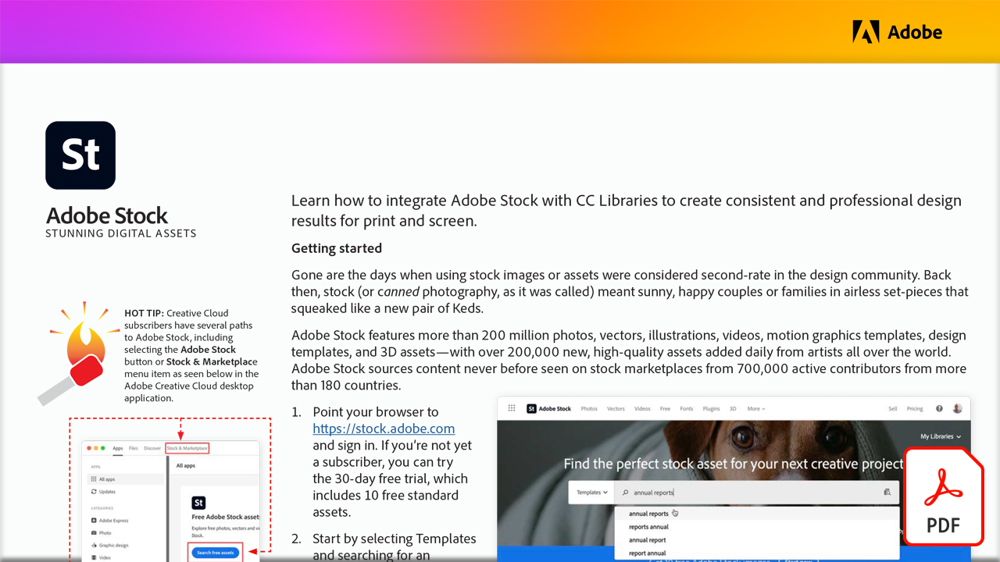

# 令人惊叹的数字资产

在本实际操作教程中，了解如何将Adobe Stock与CC Libraries集成以为打印和屏幕创建一致且专业的设计结果。

选择下方图像以查看或下载此PDF教程。

[{width="680"}](assets/Stunning-Digital-Assets.pdf){target="blank"}

>[!NOTE]
>
>保存到CC Libraries的Adobe Stock资源可以无缝添加到Microsoft PowerPoint和Word中。 可在[此处](https://helpx.adobe.com/cn/creative-cloud/help/libraries-addin-microsoft-office.html)或在Microsoft App Store中找到有关如何下载和安装Adobe Creative Cloud加载项的说明。 对于这两个应用程序，该过程都很简单，尤其是对于那些在Illustrator、InDesign或Photoshop中使用Adobe Stock有经验的用户。 有关详细信息，请访问[浏览Microsoft Office 365中的Adobe Stock集成插件](https://helpx.adobe.com/cn/stock/help/microsoft-office-plug-ins.html)。
